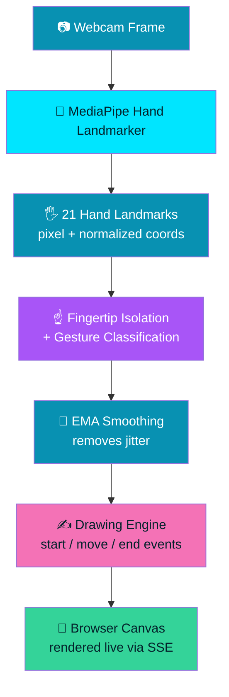

<div align="center">


<br/>

<a href="https://github.com/0xAbhi13/0xAirCanvas">
  
</a>

<br/><br/>

[](https://www.python.org/)
[](https://flask.palletsprojects.com/)
[](https://opencv.org/)
[](https://developers.google.com/mediapipe)
[](LICENSE)


<br/>

**Created by Abhishek Jadhav — [@0xAbhi13](https://github.com/0xAbhi13)**

</div>


<div align="center">

### 📚 Table of Contents

[⚡ About](#-what-is-0xaircanvas) • [✨ Features](#-features) • [🕹️ Gestures](#️-gesture-guide) • [🧠 How It Works](#-how-it-works) • [📦 Install](#-installation) • [▶️ Usage](#️-usage) • [⌨️ Shortcuts](#️-keyboard-shortcuts) • [🗂️ Structure](#️-project-structure) • [🛣️ Roadmap](#️-future-roadmap) • [📄 License](#-license)

</div>


## ⚡ What is 0xAirCanvas?

**0xAirCanvas** turns your webcam into a pen. Raise your index finger, move it through the air, and watch your fingertip become a smooth, glowing stroke on a live digital canvas — no stylus, no touchscreen, no mouse.

Under the hood, a Flask backend runs OpenCV + MediaPipe hand tracking on every camera frame, classifies your hand into one of four gestures, and streams the resulting drawing events straight into a browser `<canvas>` in real time.

<div align="center">

```text
> Initializing 0xAirCanvas...
> Camera connected            ✓
> MediaPipe initialized       ✓
> Hand detected               ✓
> Gesture engine online       ✓
> AirCanvas ready. Start drawing ☝️
```

</div>

<br/>

<div align="center">

</div>

## ✨ Features

<table>
<tr>
<td width="33%" align="center">

### 🖐️
**Real-Time Hand Tracking**
21-point landmark detection powered by MediaPipe, live on every frame.

</td>
<td width="33%" align="center">

### ✍️
**Air Writing**
Your fingertip becomes a digital pen — smoothed, low-jitter strokes.

</td>
<td width="33%" align="center">

### 🎨
**Custom Brushes**
Adjustable size, glowing neon-style strokes.

</td>
</tr>
<tr>
<td width="33%" align="center">

### 🌈
**Multiple Colors**
Seven-color palette, switch instantly mid-drawing.

</td>
<td width="33%" align="center">

### 🧹
**Smart Eraser**
Same smoothing pipeline as the brush, adjustable size.

</td>
<td width="33%" align="center">

### ↩️
**Undo / Redo**
Full history stack — step through every stroke.

</td>
</tr>
<tr>
<td width="33%" align="center">

### 💾
**PNG Export**
Save your artwork with one click or a shortcut.

</td>
<td width="33%" align="center">

### 📷
**Camera Selector**
Pick from any connected camera, hot-swap without restarting.

</td>
<td width="33%" align="center">

### 📊
**Live System HUD**
Camera status, hand detection, gesture, FPS — always visible.

</td>
</tr>
</table>

<div align="center">

### 🔒 Local Camera Processing

All video processing happens on your machine. **Nothing is uploaded or stored.**

</div>

## 🕹️ Gesture Guide

<div align="center">

| Gesture | Icon | Action |
|:---:|:---:|:---|
| Index Finger | ☝️ | **Draw** |
| Open Palm | ✋ | **Stop drawing** |
| Fist *(hold)* | ✊ | **Clear canvas** |
| Pinch | 🤏 | **Toggle brush / eraser** |

</div>

> Gestures are debounced — a fist must be held briefly before the canvas clears, so one noisy frame can't wipe your drawing.

## 🧠 How It Works



The camera frame streams to the browser as MJPEG (`/video_feed`); stroke and status events push over Server-Sent Events (`/api/events`) — so drawing is rendered entirely by the browser's Canvas API, staying smooth and independent of video frame rate.

## 🧰 Tech Stack

<div align="center">


</div>

## 📦 Installation

<details open>
<summary><b>🖱️ Click to expand setup steps</b></summary>

<br/>

**1. Clone the repo**

```bash
git clone https://github.com/0xAbhi13/0xAirCanvas.git
cd 0xAirCanvas
```

**2. Create a virtual environment**

```bash
python -m venv venv
```

<table>
<tr><th>Windows</th><th>macOS / Linux</th></tr>
<tr>
<td>

```bash
venv\Scripts\activate
```

</td>
<td>

```bash
source venv/bin/activate
```

</td>
</tr>
</table>

**3. Install dependencies**

```bash
pip install -r requirements.txt
```

**4. Run**

```bash
python app.py
```

Then open the local Flask URL shown in your terminal (typically `http://127.0.0.1:5000`).

> On first run, the hand-tracking model (~8 MB) downloads automatically and is cached locally.

</details>

## ▶️ Usage

```text
1. Launch the app and allow camera access when prompted.
2. ☝️  Raise your index finger to start drawing.
3. ✋  Open your palm to pause without erasing.
4. ✊  Hold a fist briefly to clear the canvas.
5. 🤏  Pinch to toggle between brush and eraser.
6. 🎛️  Use the control panel or shortcuts for color, size, undo/redo, save.
7. 📷  Pick a different camera anytime from the CAMERA panel.
```

## ⌨️ Keyboard Shortcuts

<div align="center">

| Key | Action | Key | Action |
|:---:|:---|:---:|:---|
| <kbd>B</kbd> | Brush | <kbd>Z</kbd> | Undo |
| <kbd>E</kbd> | Eraser | <kbd>Y</kbd> | Redo |
| <kbd>C</kbd> | Clear | <kbd>S</kbd> | Save |
| <kbd>H</kbd> | Help | <kbd>Esc</kbd> | Close modal |

</div>

## 🗂️ Project Structure

```text
0xAirCanvas/
│
├── app.py                     # Flask app, camera loop, streaming routes
├── requirements.txt
├── README.md
├── LICENSE
├── .gitignore
│
├── vision/
│   ├── __init__.py
│   ├── hand_tracker.py        # MediaPipe Hands wrapper (legacy + Tasks API)
│   ├── gesture_detector.py    # Gesture classification + debounce
│   └── drawing_engine.py      # Smoothing + stroke event generation
│
├── templates/
│   └── index.html
│
├── static/
│   ├── css/style.css
│   ├── js/app.js
│   └── assets/{logo,favicon}.svg
│
└── assets/
    ├── demo.gif                # add after recording locally
    ├── screenshot.png          # add after recording locally
    └── preview.png             # add after recording locally
```

## 🔒 Privacy

🔒 **Camera processing happens locally.** Your video is not uploaded or stored. 0xAirCanvas makes no network calls with your video data — everything runs inside your own Flask server and browser.

## 🛣️ Future Roadmap

- [ ] Multi-hand drawing
- [ ] Air handwriting recognition
- [ ] Shape recognition
- [ ] AI-assisted drawing
- [ ] Gesture-based shortcuts
- [ ] Drawing replay
- [ ] Advanced brush effects
- [ ] Image import

<div align="center">

</div>

## 👨‍💻 Author

<div align="center">

### Abhishek Jadhav

Creator of 0xAirCanvas — building creative projects with Python, AI, computer vision, and web technologies.

[](https://github.com/0xAbhi13)

</div>

## 📄 License

Released under the [MIT License](LICENSE).

<div align="center">


**Made with ☝️ and a webcam.**

</div>
